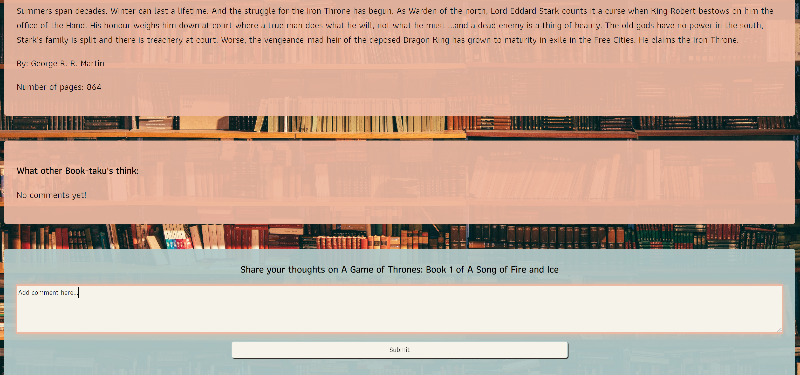

# BOOK-TAKU

## Description
Book-taku is a book database which users can interact with to see information about a list of books and add comments to books. Book information is saved in a mySQL database and is displayed in an online Library format in the Book-taku application. The application allows users to add comments and read comments from other users on different types of books. The Book-taku application is responsive and interactive, and is  deployed on Heroku. 

## Table of Contents
* [User Stories](#userstories) 
* [Acceptance Criteria](#acceptancecriteria)
* [Resources](#resources)
* [Installation](#installation)
* [Usage](#usage)
* [Contributions](#contributions)

## User Stories 
- AS A book-taku, I WANT to be able to find books from an extensive book library SO THAT I don’t have to search books on multiple websites  
- AS A book-taku, I WANT to be able to add comments to books SO THAT I can inform other book-takus about my opinions 

## Acceptance Criteria 
- WHEN I click on the application link 
  THEN I am presented with a page consisting of login and signup options 
- WHEN I login using my information 
  THEN I am taken to a “Library” page with book titles/covers 
- WHEN I click on a book title/cover
  THEN I am taken to a page consisting of book name, author, number of pages, hardcover or paperback, a 2 sentence blurb, and a “add review” option
- WHEN I click on “add comment"  
  THEN the review is appended at the bottom of the page 

## Resources

- [Pagination api's NPM](https://www.npmjs.com/package/pagination-apis)
- [Colour Palette Inspo](https://icolorpalette.com/download/svg/232624_icolorpalette.svg)
- [Favicon.ico](https://favicon.io/)
- [Express-session Documentation](https://www.npmjs.com/package/express-session#user-content-secret)
- [Sequelize Documentation](https://sequelize.org/docs/v6/)
- [Handlebars Documentation](https://handlebarsjs.com/guide/#what-is-handlebars)
- [ESLint Documentation](https://eslint.org/docs/user-guide/getting-started)
- [Prettier Documentation](https://prettier.io/docs/en/index.html)
- [MDN Docs](https://developer.mozilla.org/en-US/)
- [Stackoverflow](https://stackoverflow.com/)
- [W3Schools Pagination](https://www.w3schools.com/css/css3_pagination.asp)
- [Design System Pagination](https://design-system.w3.org/components/pagination.html)

## Installation

### Downloading Visual Studio Code 

 Download the latest version of Visual Studio to your local machine (Mac, Linux or Windows). Please use the following link to download the latest version of VS Code [Download VS Code](https://code.visualstudio.com/download). 

### Pulling the repository from Git 

If you would like to acess the source code, please navigate to the following public Github repository [Github Repository](git@github.com:amiresf1983/Book-taku.git). 

* Clone the repository to your local desktop using the following steps:

  * 🔑 Use the terminal command `cd` to navigate to the directory where we want the repository located. In this case, we will save it to the Desktop. 

  ```bash
  cd Desktop
  ```

  * 🔑 Use the git command `git clone` followed by the URL copied from Github to clone the repo to our local machine.

  ```bash
  git clone <url>
  ```

  * 🔑 Use the `git clone` command creates a new directory with the same name as the repository. We navigate into our new directory using `cd`.

  ```bash
  cd Book-taku
  ```
* After the repository has been cloned to your local machine, open the files using Visual Studio application. 

## Usage 
In order to see a application deployed on Heroku, navigate to the following link: [https://book-taku.herokuapp.com/](https://book-taku.herokuapp.com/). 


In order to run the applicational locally, follow the below steps. 

* Step 1: Change into the directory of the application 
* Step 2: Install all the necessary npm packages by running the following command: 

  ```bash
  npm start  
  ```
* Step 3: Run by using the following command in the command terminal in VS Code. 

  ```bash
  npm start  
  ```
* Step 4: You will be presented with the application by entering http://localhost:3001/ in the browser. 


* Step 5: If you are a new user, click on "Login" and then follow the "Sign up now" link. If you already have an account, simply log in using Username and Password. 


* Step 6: To add a review to a book, click on "Library" and click on the book title to which you would like to add a review. You will then be taken to a page with book details and an option to add a review. 



## Contributions 
- Christi Scappatura 
- Jemima Siddiqui 
- Andrew Ouyang 
- Jinhee Lee 
- Amir Esfandiari 


